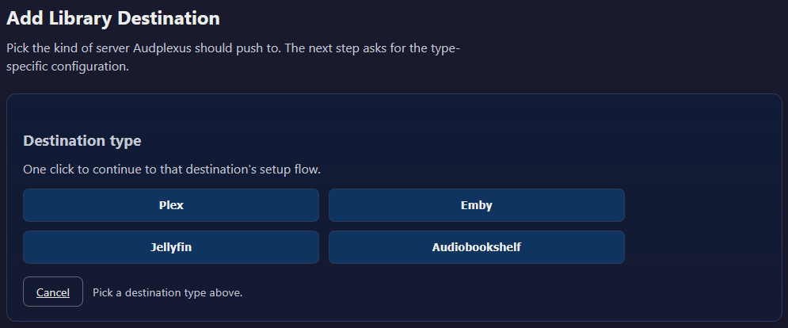

# Connect a Library Destination

Use this when you want Audplexus to push finished books into your media server library.

Supported destination types:

- Plex
- Emby
- Jellyfin
- Audiobookshelf

## Add a Destination in the Web UI

1. Open Settings -> Library Destinations.
2. Select Add destination.
3. Pick destination type.
4. Fill required fields.
5. Select Test Connection.
6. Save.

Repeat for each server/library you want. Multiple destinations of the same type are supported.

## Required Values by Type

### Plex

- Server URL
- Token
- Section ID (audiobook library section)

### Emby

- Server URL
- API key
- Library ID

### Jellyfin

- Server URL
- API key
- Library ID

### Audiobookshelf

- Server URL
- API key
- Library ID

## Check Connection Health

Each destination has a Test Connection action.

Use it when:

- first adding a destination
- changing URL/token/key/library ID
- troubleshooting missing books

## Enable or Disable a Destination

Disable a destination when a server is down or being migrated.

Behavior:

- Disabled destination is skipped.
- Other enabled destinations continue processing.

## Path Mapping (When Server Cannot See the Same Path)

If media server reads a different mount path than Audplexus:

1. Set Audiobook Path (source path seen by Audplexus).
2. Set Destination Path (target path seen by the destination server).

This helps targeted scans and matching use the correct server-visible path.

